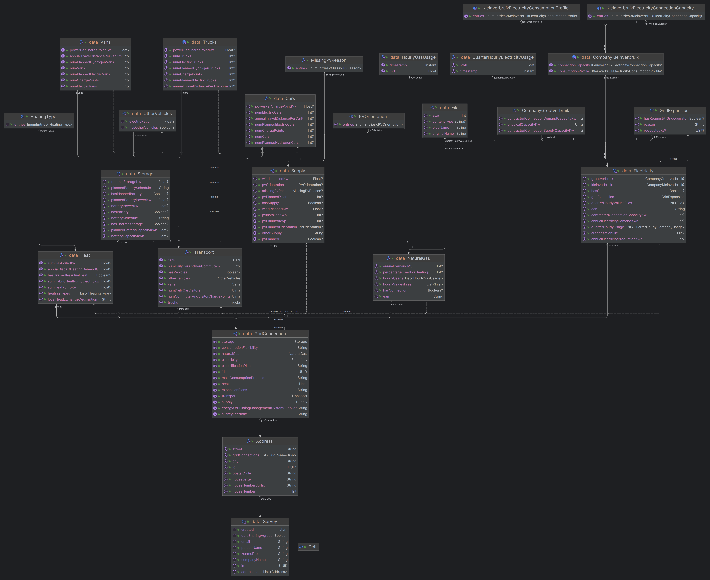

 Zenmo Zero
==========

Table of Contents
-----------------

- [About](#about)
- [Components](#Components)
- [Running locally](#running-locally)

About
-----

Zenmo Zero is a tool to simulate local energy systems.

This repository contains a web-based application to help bootstrap the Zenmo Zero simulation model with external data.

Works together with:

* [Zero Engine](https://github.com/Zenmo/zero_engine)
* [Zero Results UI](https://github.com/Zenmo/zero_results_UI)

Components
----------

### [Frontend](frontend)

Graphical user interface. The company survey forms are here ([try one here!](https://zero-test.zenmo.com/bedrijven-hessenpoort)) and its web interface for administrators ([screenshot](docs/admin-screenshot.jpg)). 

It is hosted at [zero.zenmo.com](https://zero.zenmo.com).

This can also build a front-end library to include the survey in external websites.

### [Ztor](ztor)

This is the REST backend built on Ktor framework. 
Like AnyLogic it leans on the Java ecosystem.

### Vallum

Client for Ztor. This is a library to access the REST API from AnyLogic.
Artifacts are published to [TODO](https://github.com/zenmo/)

### [Zummon](zummon)

Contains code to share between the front-end and other components. 
Builds to both an NPM package and JVM artifact. 

### [Zorm](zorm)

Object-relational mapper for the core domain. This is to store surveys of companies in 
modelled business parks.

A library to access the domain entities from AnyLogic can be downloaded from [GitHub Packages](https://github.com/Zenmo/zero/packages/2104350)

This contains:

* database schema definition
* mapping to Java data transfer objects
* create, read, update and delete methods

#### Data transfer objects class diagram:


(generated using Intellij)

#### Database relations:


(generated using Intellij)

#### Planned database relations:

(created using draw.io)


### [Migrations](migrations)

This contains database migrations for PostgreSQL.
This intends to include ALL tables used by the web application and data import tools.

The SQL schema is generated by the Ktor application.
The migrations are created manually by diffing the generated schema with the previous version. Datagrip or pgAdmin can help create such a diff.

The migrations are applied by Flyway.

### [EP Online](ep-online)

This is a script to import the national dataset of energielabels to a PostgreSQL database.

### [Kleinverbruik](kleinverbruik)

Stedin, Liander and Enexis publish usage data of natural gas and electricity anually.
This is a small webservice which wraps this data so the frontend can request small parts of the data.

(this is partly defunct and this approach will be discontinued in favor of a database import).

Running locally
---

Run the web application locally using Docker Compose:

```bash
docker compose up ztor-run frontend
```

Then navigate to [http://localhost:1234](http://localhost:1234).
